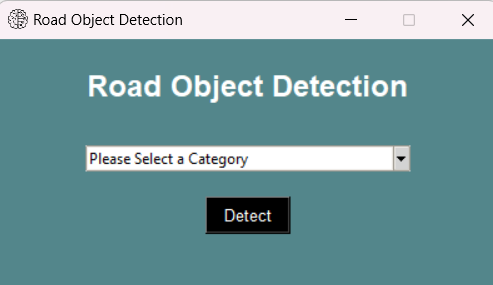
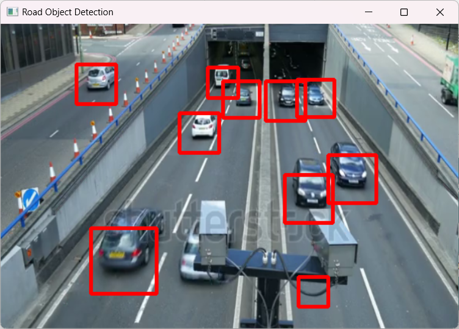
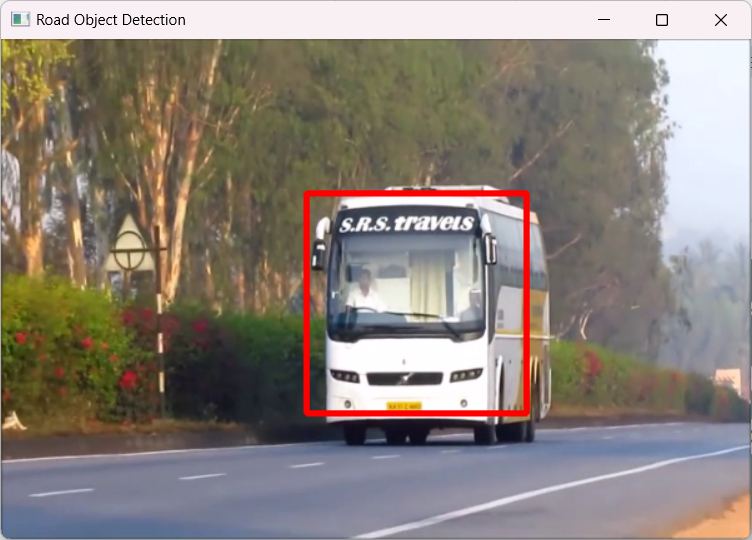
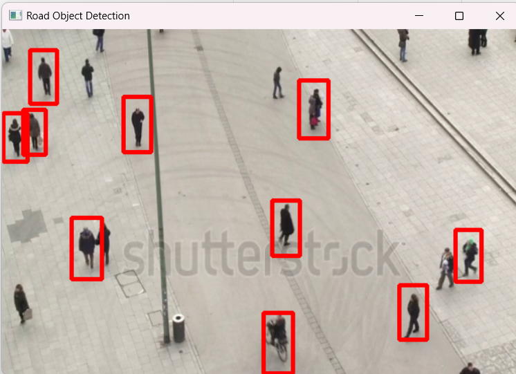
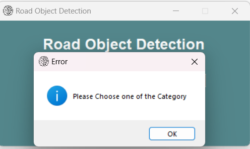

# Road Object Detection

Showcases Object Detection Algo on any road passage. Detects every type of vehicle as well as pedestrian walking on the road.

Algo Used for Detection: `Cascade Classifier` for *cars*, *bus*, *two wheeler* and *pedestrian*


## Installation

Step-by-step instructions on how to set up and run the project locally.

1. Clone the repository:

```bash
  git clone https://github.com/farhan0001/Road-Object-Detection.git
```
2. Navigate to the project directory:

```bash
  cd src
```
3. Install dependencies:

```bash
  pip install cv2 tkinter
```
## Run Locally

### Run Algo in Terminal

1. Convert notebook to a Python script

```bash
  jupyter nbconvert --to script Road_Object_Detection.ipynb
```
2. Run the generated script

```bash
  python Road_Object_Detection.py
```

### Run Algo as App

1. Convert file in executable

```bash
  python -m PyInstaller --noconsole --onefile --icon=Detection.ico main.py
```

2. Go into `dist` folder generated
3. Paste `assets` folder here
4. Run the **main.exe** file

## Screenshots

1. Main GUI



2. Car Detection



3. Bus Detection



4. Two Wheeler Detection


5. Pedestrian Detection



6. If no Category selected




## Tech Stack

**Language:** Python

**Libraries:** Opencv, Tkinter

## Logo

